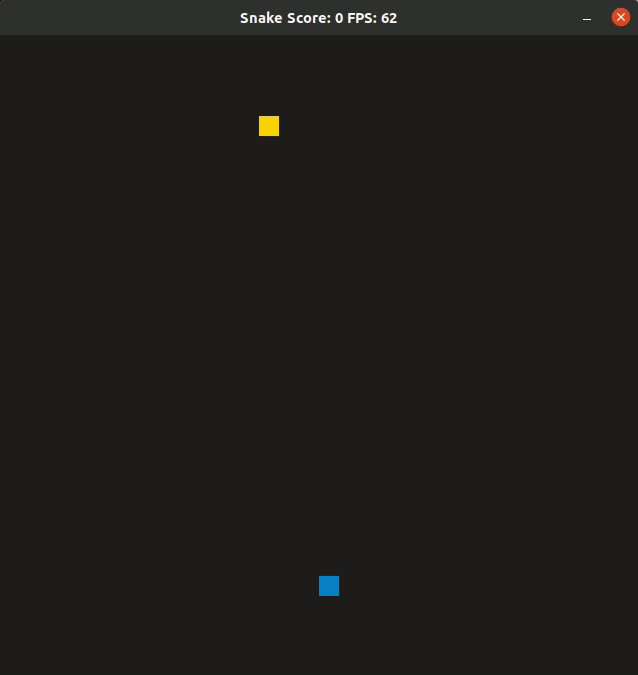

# CPPND: Capstone Snake Game
(I chose "CPPND : Capstone Snake Game" as a base project.)

In this game, you control a snake and guide it to a food.
Yellow food is good for the snake, and the snake gets longer if the snake eats it.
Red food is toxic, so the snake dies if the snake eats it.

## Dependencies for Running Locally
* cmake >= 3.7
  * All OSes: [click here for installation instructions](https://cmake.org/install/)
* make >= 4.1 (Linux, Mac), 3.81 (Windows)
  * Linux: make is installed by default on most Linux distros
  * Mac: [install Xcode command line tools to get make](https://developer.apple.com/xcode/features/)
  * Windows: [Click here for installation instructions](http://gnuwin32.sourceforge.net/packages/make.htm)
* SDL2 >= 2.0
  * All installation instructions can be found [here](https://wiki.libsdl.org/Installation)
  >Note that for Linux, an `apt` or `apt-get` installation is preferred to building from source. 
* gcc/g++ >= 5.4
  * Linux: gcc / g++ is installed by default on most Linux distros
  * Mac: same deal as make - [install Xcode command line tools](https://developer.apple.com/xcode/features/)
  * Windows: recommend using [MinGW](http://www.mingw.org/)

## Basic Build Instructions

1. Clone this repo.
2. Make a build directory in the top level directory: `mkdir build && cd build`
3. Compile: `cmake .. && make`
4. Run it: `./SnakeGame`.

## How to play

* Control a snake and get a yellow food.
* If the snake eats a yellow food, the snake gets longer, score increases, and the number of toxic food increases.
* If the snake eats a red food, the snake dies and Game is over, because it is a toxic food.

* How to control the snake : Use arrow keys.

* Push "p" key to Pause the game, and push "r" key to Resume(Re-start) the game.

## Rubric points addressed
I added or modified the features described below.
1. Added Food class
  Rubric point in this item :
    1. The project uses Object Oriented Programming techniques. and Classes encapsulate behavior.
      Defined Food class to have some attributes. (e.g. Food.attr, Food.position)
    2. Classes use appropriate access specifiers for class members.
      Added some public functions to access class members in Food.
        void SetPosition(int x, int y);
        bool CheckIfFoodIsThere(int x, int y);
        SDL_Point GetPosition();
        bool CheckFoodIsToxic();
    3. Class constructors utilize member initialization lists.
	    Utilized member initialization lists for the private member "attr".
    4. The project makes use of references in function declarations.
      To access "Food vector elements" from "Renderer::Render()" function, passed "&food" as a reference.

2. Added GameState class -> by this, player can pause/resume the game
  Rubric point in this item : 
    1. The project accepts user input and processes the input. ("p" for pause, and "r" for resume the game)
    2. The project makes use of references in function declarations.
      To access "current_state" in "GameState" class from "Controller::HandleInput()" function, passed "GameState &state" as a reference.
    3. Class constructors utilize member initialization lists.
	    Utilized member initialization lists for the private member "current_state" in GameState class.

3. Increased number of food
  Rubric point in this item :
    1. The project demonstrates an understanding of C++ functions and control structures.
     Defined "std::vector<Food> food", and used "for ( auto f : food )" control structure in "Game::PlaceFood()" and "Game::Update()" and "Renderer::Render()".

4. Added different type of food (Toxic food

## CC Attribution-ShareAlike 4.0 International

Shield: [![CC BY-SA 4.0][cc-by-sa-shield]][cc-by-sa]

This work is licensed under a
[Creative Commons Attribution-ShareAlike 4.0 International License][cc-by-sa].

[![CC BY-SA 4.0][cc-by-sa-image]][cc-by-sa]

[cc-by-sa]: http://creativecommons.org/licenses/by-sa/4.0/
[cc-by-sa-image]: https://licensebuttons.net/l/by-sa/4.0/88x31.png
[cc-by-sa-shield]: https://img.shields.io/badge/License-CC%20BY--SA%204.0-lightgrey.svg
